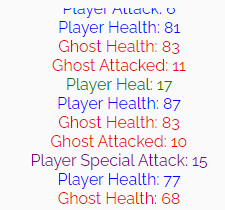

# Monster Game

Welcome to the <a href="https://berger101.github.io/Monster-Game/">Monster Slaying Game</a>, an exciting text-based adventure where you, the player, embark on a journey to defeat monstrous creatures and try your best luck to emerge victorious! It features four totally chosen random monsters all ready to face and utterly defeat the users character to steal your glory and fame. Each monster presents a unique set of challenges, requiring players to adapt their strategies and make tactical decisions to emerge victorious in the Monster Slaying Game. Good luck, brave adventurer!

## Wireframes

 

## Game Features

<ul>
  <li>Four randomly chosen monsters with unique abilities.</li>
  <li>Dynamic Health Bars: Visualize your health and the monster's health with dynamic health bars.</li>
  <li>Log Messages: Receive real-time updates and battle logs in the message container.</li>
  <li>Game Over: The game ends in a draw or when either you or the monster is defeated.</li>
</ul>

Header
<ul> 
  <li>Featured at the top of the page, the header shows the game header imagee in the left corner and the game name: Monster Slaying Game.</li>
  <li>This header clearly tells the user what game they are playing.</li>
</ul>

Game Area
<ul> 
  <li>The game area section forms the game main component, it shows the name, image and healthbar of both the player and the monster.</li>
  <li>The game area constantly change while playing the game.</li>
  <li>The monster you face is random everytime a new game is commenced, so a random monster name and image will appear.</li>
  <li>The healthbar value will change from green to red meaning it decreases depending on the damage from the player or the monster.</li>
</ul>

Game Options
<ul> 
  <li>The game options section have five different buttons, attack, special attack, heal, surrender and start new game.</li>
  <li>Everytime an action is made the monster will take it's turn and attack the player, damaging the players healthbar. Beware the monsters hit hard, so choose your next move with care.</li>
  <b>Attack the Monster:</b>
  <li>Click the "Attack" button to unleash a standard attack on the monster. Keep an eye on your health and the monster's health as you battle through rounds.</li>
  <b>Special Attack:</b>
  <li>After every three rounds, you can use a powerful "Special Attack" to deal extra damage to the monster. Plan strategically to maximize your impact!</li>
  <b>Heal Yourself:</b>
  <li>Click the "Heal" button to restore some of your health. Be cautious, as excessive healing might lead to a draw or even defeat if the monster is too powerful. This action is only available every second round.</li>
  <b>Surrender:</b>
  <li>If the odds seem insurmountable, you can choose to surrender and end the game. All buttons will be enabled, and the game will reset.</li>
  <b>Start a New Game:</b>
  <li>Click the "Start New Game" button to initiate a new adventure. All buttons will be enabled, and the game will reset.</li>
</ul>

Log Messages
<ul>
  <li>The game generates log messages to provide real-time updates and information about the ongoing battle. These messages are displayed in the log container within the game interface.</li>
  <li>Log messages offer immediate feedback on player actions, such as attacks, special attacks, healing, and more. Players can see the impact of their decisions on the game state.</li>
  <li>Log messages are color-coded to improve readability and categorize different types of actions. For example, blue messages represent the player and the player attacks, green messages represent healing actions, purple messages represent special attack actions, and red messages represent the monster.</li>
</ul>

Monsters
<ul>
  <b>Big Monster:</b>
  <li>The Big Monster is a colossal and formidable creature with immense strength and durability. Its attacks pack a significant punch, and defeating it requires strategic planning and skill. Watch out for its powerful blows and be prepared for a challenging battle against this giant adversary.</li>
  <b>Fire Demon:</b>
  <li>The Fire Demon is a creature from the depths of the underworld, wielding the power of flames. Its attacks are accompanied by scorching fire, dealing both physical and fire damage. Players need to be cautious and consider using fire-resistant equipment or special tactics to overcome this fiery foe.</li>
  <b>Ghost:</b>
  <li>The Ghost is a spectral entity with the ability to phase in and out of the physical realm. It possesses ethereal attacks that may bypass traditional defenses. Engaging with a Ghost requires a keen understanding of its supernatural abilities, and players might need specific tools or skills to combat this elusive and haunting adversary.</li>
  <b>Vampire:</b>
  <li>The Vampire is a cunning and immortal creature that feeds on the life force of its victims. It has the ability to regenerate health during battle, making it a challenging opponent. Players should consider employing tactics that disrupt the Vampire's life-draining abilities and exploit its weaknesses to ensure success in the fight.</li>
</ul>

## Refactoring

<ul>
  <li>After building the monster slaying game project, I decided to look how to make the code more clean and shorten the length of some repetitive code.</li>
  <li>I remade some functions into arrow functions.</li>
  <li>I refactored some if-else statements into ternary operators.</li>
  <li>I made my click event listener into switch case and functions instead of one big pile of code.</li>
  <li>I took away repetitive code and made it into functions to be reused several times.</li>
</ul>

## Testing

<ul>
  <li>I tested that this page works in different browsers: Chrome, Firefox, Safari.</li>
  <li>I confirmed that this project is responsive, looks good and functions on all standard screen sizes using the devtools device toolbar.</li>
  <li>I confirmed that all the buttons work and does the correct function.</li>
  <li>I confirmed that the messages in the log container are the correct values.</li>
  <li>I confirmed that the instructions and options are readable and easy to understand.</li>
</ul>

## Validator Testing

HTML
<ul>
  <li>No errors were returned when passing through the official <a href="https://validator.w3.org/">W3C validator</a>.</li>
</ul>

CSS
<ul>
  <li>No errors were found when passing through the official <a href="https://jigsaw.w3.org/css-validator/">(Jigsaw) validator</a>.</li>
</ul>

Accessibility
<ul>
  <li>I confirmed that the colors and fonts chosen are easy to read and accessible by running it through the official <a href="https://pagespeed.web.dev/">lighthouse (PageSpeed) validator</a>.</li>
</ul>

JSHint
<ul>
  <li>I confirmed there were no necessary warnings found when passing through the official <a href="https://jshint.com/">JSHint validator</a>.</li>
  <li>Warnings found in jshint is because of the prettier extension in VS Code and choosen not to be changed.</li>
</ul>

## Deployment

The site was deployed to GitHub pages. The steps to deploy are as follows:
<ul>
  <li>In the GitHub repository, navigate to the Settings tab</li>
  <li>From the Source section drop-down menu, select the Main Branch</li>
  <li>Once the main branch has been selected, the page provided the link to the completed website</li>
</ul>
The live link can be found here - <a href="https://berger101.github.io/Monster-Game/">Monster Game</a>

## Credits

Content
<ul>
  <li>Some of the text for the README.md file were taken from <a href="https://chat.openai.com/">ChatGPT</a></li>
</ul>

Styling
<ul>
  <li>The styling for the game area was largely taken from the CI <a href="https://jcav23.github.io/CodeInstitute_LoveMaths/">Love Maths</a> project.</li>
</ul>

Media
<ul>
  <li>The images for the player and monsters were taken from <a href="www.google.com">Google</a></li>
</ul>
